# Final Project!

Team members: Annie Qiu, Catherine Cheng, Yifan Lu

## Project planning: Design Doc (due 11/6)
Before submitting your first milestone, _you must get your project idea and scope approved by Rachel, Adam or a TA._

### Design Doc
[Google Doc Link](https://docs.google.com/document/d/169RYszQZ5gILNnsS2ZpIwD5Kloa3naZebUqEEF6zlcY/edit?tab=t.0#heading=h.kq99tkua9efe)

#### Introduction
Our project is motivated by a desire to blend Eastern traditional art with the futuristic aesthetics of cyberpunk, inspired by **Ghost in the Shell** and **Blade Runner 2049** which provide impressive visual effects and stunning cyberpunk scenes. The cyberpunk style is captivating, by combining it with Eastern aesthetics which can create a unique vision of ancient and futuristic elements.

#### Goal
We want to incorporate procedural asset creation into environment creation, combine it with textures, and eventually create an astonishing scene.

#### Inspiration/reference:
| Reference | Image |
|-----------|-------|
| [Main Reference](https://www.artstation.com/artwork/dyyoeJ) |  |
| [Reference1](https://www.artstation.com/artwork/29kdgB) |  |
| [Reference2](https://www.artstation.com/artwork/Yeg6aY) |  |
| [Reference3](https://www.theverge.com/2017/4/1/15142948/ghost-in-the-shell-1995-original-setting-most-interesting-part) | :format(webp)/cdn3.vox-cdn.com/uploads/chorus_asset/file/8261407/Ghost_Shell_1995_Screenshot_0399.jpg) |
| [Reference4](https://aiinscreentrade.com/2024/05/29/the-importance-of-theme-exploring-existentialism-in-blade-runner-2049/) |  |
| [Reference5](https://www.artstation.com/artwork/G89oz) |  |

#### Specification:
- Traditional Building Generator

| Reference  |
|---------|
|  |

- Factory Building Generator

| Reference 1 | Reference 2 |
|---------|---------|
|  |  |

- Material fir procedural buildings(Tileable textures)
- City Layout
- Lighting(Light Billboard)
  
#### Techniques:
- Lights Generation Problem
  - Asset Generation and Placement in Houdini (Separate assets from main buildings in order to assign light textures in UE5)
  - Emissive Surfaces Assignment in UE5
- Houdini Procedural Building Generator
  - Traditional building: Will use technique from HW3 to create multiple-level eastern style buildings. We could make a series of different windows, doors, and billboards and assemble them into buildings. Between different levels, we could add an eastern style roof with adjustable height and size. On the top of the building, we could also add a procedural top roof.
  - Factory Building:  Will use technique from HW3 to create multiple-level factory-style buildings. We could make a series of wires, windows, doors， and cables, and assemble them into buildings. Between different levels, we could add some stairs among each level and smokestacks on the top of the building.
- City Generation
  - PDG: We will use a Procedural Dependency Graph in Houdini to automate and manage complex tasks in our procedural city generation pipeline. PDG allows us to efficiently handle dependencies across asset instancing, and layout generation to make large-scale cityscapes.
  - https://youtube.com/playlist?list=PLXNFA1EysfYnWlvVy1ZzpzZd6Reyxmwxj&si=ADTaVLZNjySiRL2V
- Tileable Textures:
  - Assign simple materials to classify the material in Houdini
  - Using Substance Designer to create tileable textures
  - Attach those materials in Unreal Engine 5

#### Design:
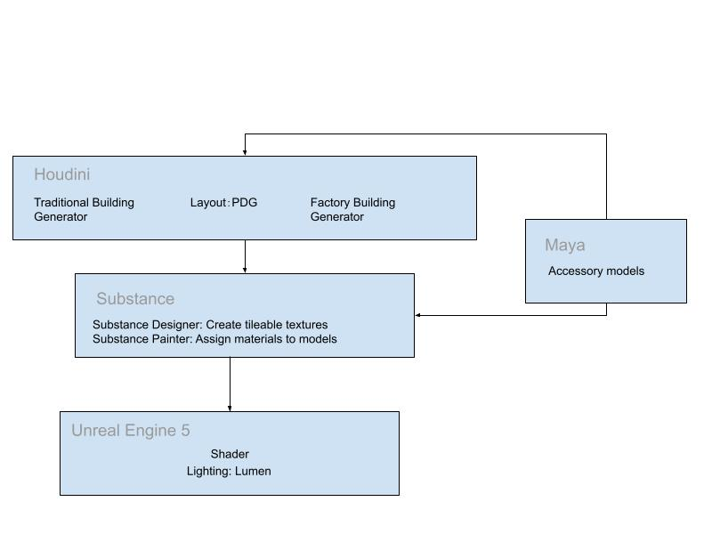

#### Timeline:
| Time                          | Annie Qiu                                                                                      | Catherine Cheng                                                                              | Yifan Lu                                                                                                   |
|-------------------------------|-----------------------------------------------------------------------------------------------|----------------------------------------------------------------------------------------------|------------------------------------------------------------------------------------------------------------|
| **Week 1: 2024/11/6 - 2024/11/13** | Factory building (FB) generator & basic light billboar setup | Traditional building (TB) generator & basic light billboard setup                            | Create tileable texture and material with substance designer. (Concrete/Metal Wall FB, Brick/Wood Wall TB, Roof TB, Road and pedestrian walk, Rolling door)PDG: City Layout & Procedural city generation pipeline |
| **Week 2: 2024/11/14 - 2024/11/20** | Refine factory generator & Billboard generator& Integration with PDG                                             | Refine building models & integrate with the pipeline & integrate with material                                         | PDG: City Layout & Procedural city generation pipeline                                  |
| **Week 3: 2024/11/21 - 2024/11/25** | Accessory modeling: Bridge; stairs; VFX Snow (Niagara System) | Accessory modeling & texturing Tree Street lamp Trash can Utility pole                   | Accessory modeling & texturing: vender machine, blockers                                                  |
| **Week 4: 2024/11/26 - 2024/12/2**  | Layout and lighting                                                                       | Layout and lighting                                                                         | Layout and lighting                                                                                        |

## Milestone 1: Implementation part 1 (due 11/13)
Begin implementing your engine! Don't worry too much about polish or parameter tuning -- this week is about getting together the bulk of your generator implemented. By the end of the week, even if your visuals are crude, the majority of your generator's functionality should be done.

Put all your code in your forked repository.

Submission: Add a new section to your README titled: Milestone #1, which should include
- written description of progress on your project goals. If you haven't hit all your goals, what's giving you trouble?
- Examples of your generators output so far
We'll check your repository for updates. No need to create a new pull request.

### Annie Qiu
For Milestone 1, my goal was to implement a Factory Building (FB) generator along with a basic light billboard setup in Houdini. Sharing similar tasks of creating light billboar with other member, I instead chosed to focus more on creating additional asset generators(stairs, roadblock and chimney) to enhance the overall factory atmosphere. This milestone centered on building the foundational structure of the FB generator from scratch.

To achieve factory buildings generation, I created two main generators:

- Building Generator: This generator uses adjustable parameters for floors, x, y, and z dimensions to define the basic structure of the factory. The generator includes essential elements like fences, chimneys, and an elevated middle section for a more industrial feel.

- Escape Ladder Generator: With similar adjustable parameters, this generator creates escape ladders that can integrate with the factory building, adding both functionality and visual appeal.

In addition to the main building, I developed smaller asset generators:

- Roadblock Generator: This asset allows customization of the number of triangular shapes.
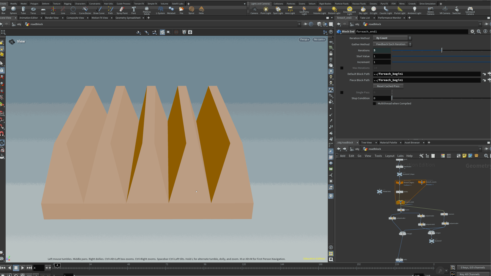

- Chimney Generator: Here, I added an iteration parameter to create distinct, customizable chimney shapes.
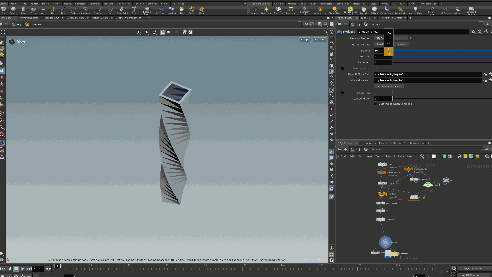

### Yifan lu

My job for Milestone1 is to create some procedural textures for both traditional building and the factory building. The textures are created with Substance Designer to give them procedural parameters. Since the most visually-impact part of the TB is the roof, I created a 2K texture with the following parameters:

| Stain Scale | Tile Hue Color | Hole Size
|---------|---------|---------|
| 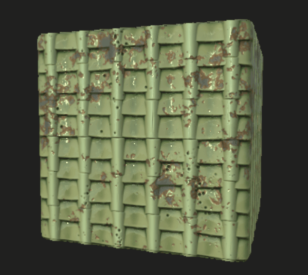| 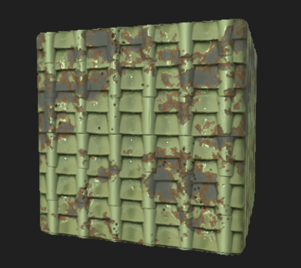| 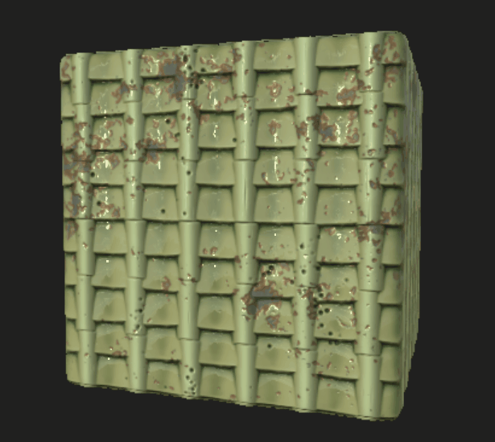|

The node network for Tile texture:
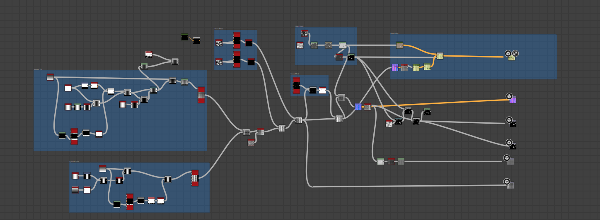

For the concrete texture I add more types of cracks, divos and stains to adapt to the broken vibe of our concept art.
| Large Divots | Cracks | Grunge | Albedo
|---------|---------|---------|---------|
| 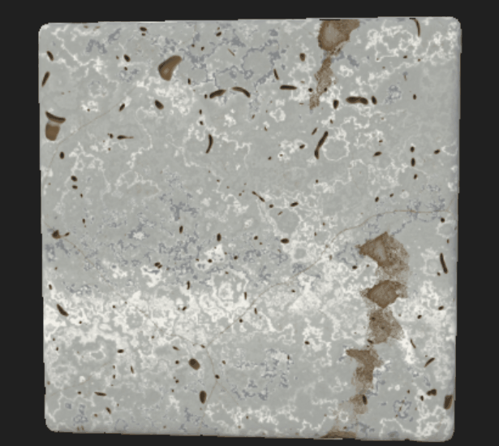| 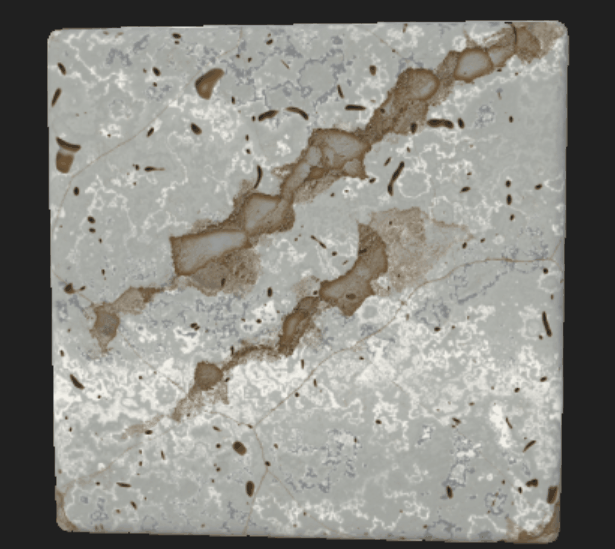| | |

The node network for Concrete texture:
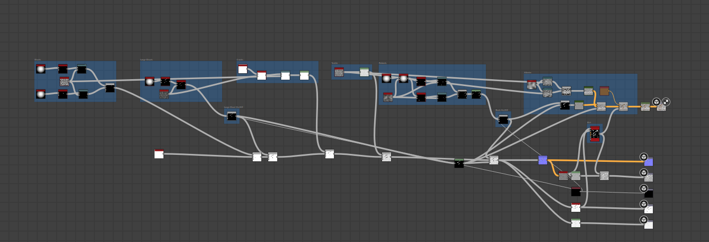

### Catherine Cheng
Traditional building generator with billboard and bridges connecting different buildings:
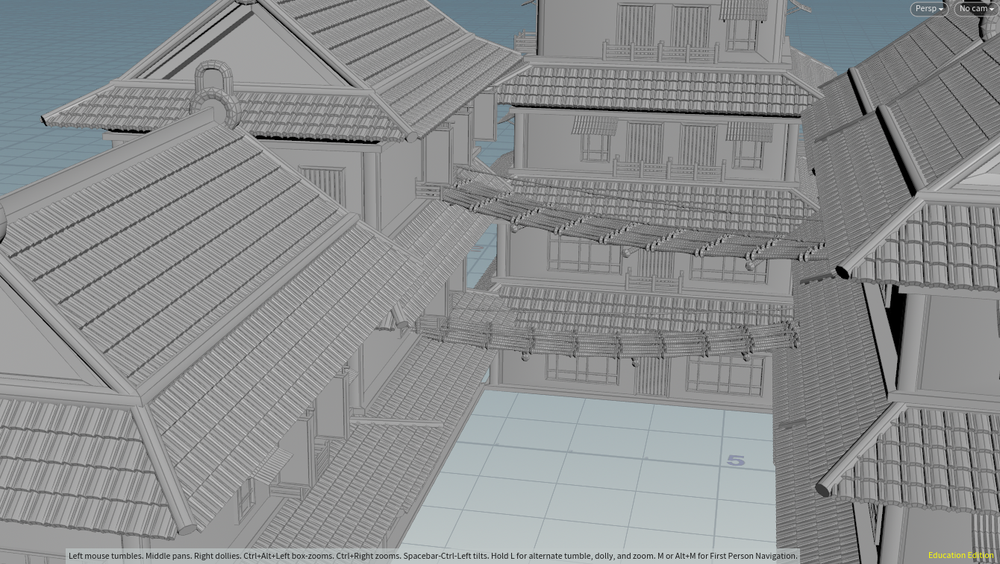
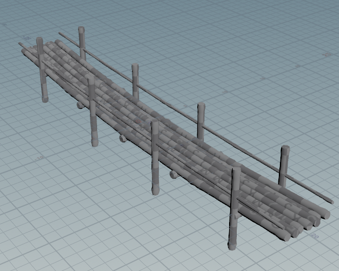

Built up the pipeline to texture procedural meshes using Substance Designer & Painter:
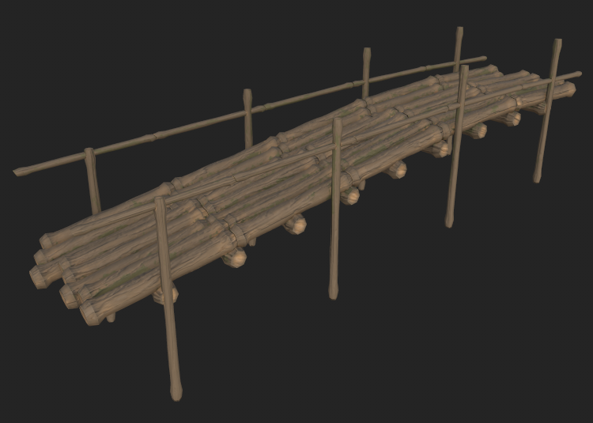

Built up the pipeline for importing .hda meshes in UE5
| UE5 World View with Texture | HDA Panel |
|---------|---------|
| | | 

## Milestone 2: Implementation part 2 (due 11/25)
### MS2 Demo Video (Golden Hour🌇):
https://github.com/user-attachments/assets/79ed4a32-bc27-4735-a8d5-102933c65c61

### MS2 Features:
- PDG network to layout 3 types of buildings based on a street map

  | Stages | Image |
  |---------|---------|
  | Grid Texture | 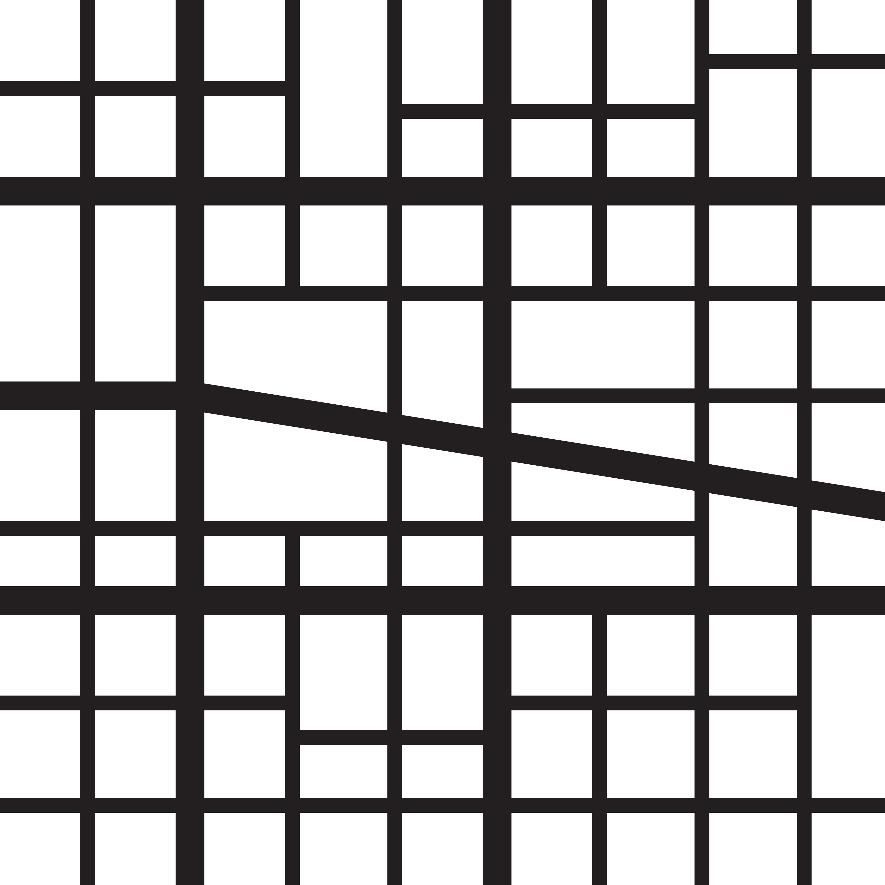)|
  | Grid in Houdini| 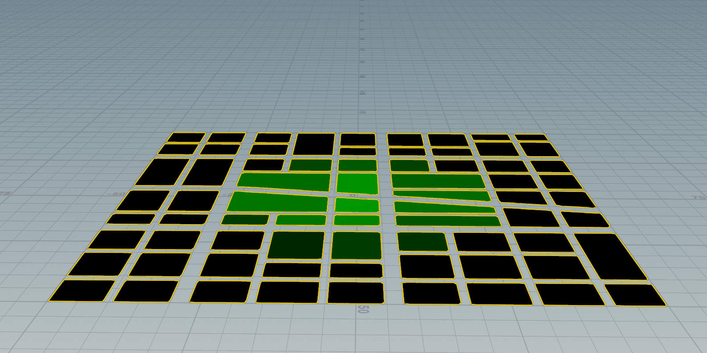|
  | Layout in Houdini| 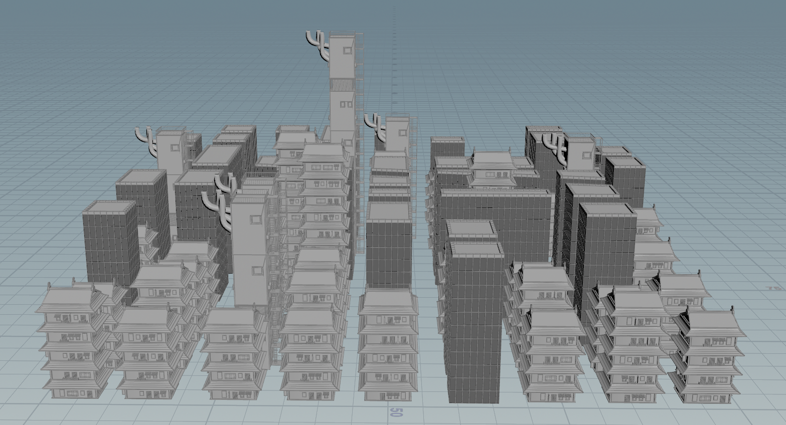)|
  | Layout in Unreal| 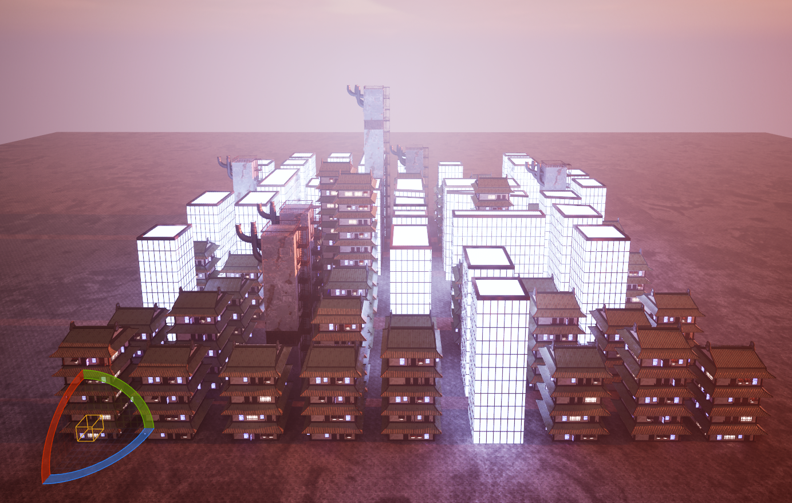)|

- Pipeline for PDG from Houdini to UE5, including building shapes and materials

| Traditional | Factory |
|-------------|---------|
| 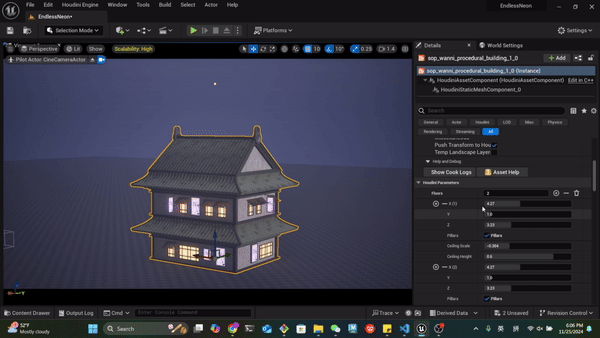 |  |

  - For materials in UE5, we have written a template for further adjusting tiling, base color tone, hue, saturation, and brightness.

  | Material Template | Matierials |
  |---------|---------|
  | 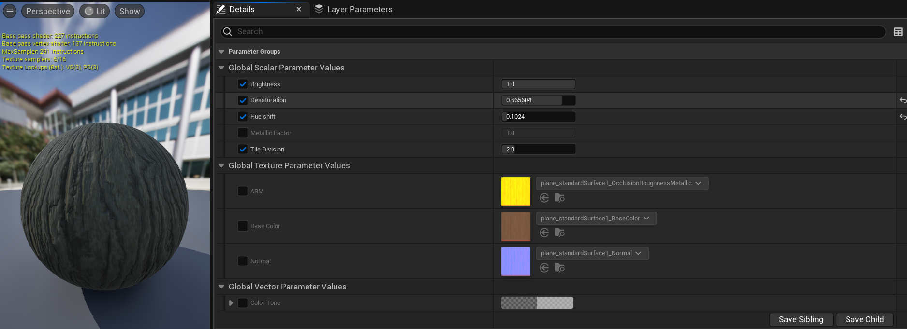| 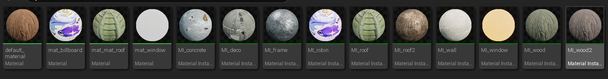| 

- Pipeline to generate texture from SD to SP and UE5 with a custom template to compress AO, Roughness and Metallic into one texture.

| Custom Texture Template in Substance Designer | Procedural Texture in UE imported from SD |
|---------|---------|
| | |

### MS3 Goals:
- Billboard texture
- PDG
  - layout
  - building type depend on the grid size
- Character
- Small models

## Final submission (due 12/2)
Time to polish! Spen this last week of your project using your generator to produce beautiful output. Add textures, tune parameters, play with colors, play with camera animation. Take the feedback from class critques and use it to take your project to the next level.

Submission:
- Push all your code / files to your repository
- Come to class ready to present your finished project
- Update your README with two sections 
  - final results with images and a live demo if possible
  - post mortem: how did your project go overall? Did you accomplish your goals? Did you have to pivot?

## Topic Suggestions

### Create a generator in Houdini

### A CLASSIC 4K DEMO
- In the spirit of the demo scene, create an animation that fits into a 4k executable that runs in real-time. Feel free to take inspiration from the many existing demos. Focus on efficiency and elegance in your implementation.
- Example: 
  - [cdak by Quite & orange](https://www.youtube.com/watch?v=RCh3Q08HMfs&list=PLA5E2FF8E143DA58C)

### A RE-IMPLEMENTATION
- Take an academic paper or other pre-existing project and implement it, or a portion of it.
- Examples:
  - [2D Wavefunction Collapse Pokémon Town](https://gurtd.github.io/566-final-project/)
  - [3D Wavefunction Collapse Dungeon Generator](https://github.com/whaoran0718/3dDungeonGeneration)
  - [Reaction Diffusion](https://github.com/charlesliwang/Reaction-Diffusion)
  - [WebGL Erosion](https://github.com/LanLou123/Webgl-Erosion)
  - [Particle Waterfall](https://github.com/chloele33/particle-waterfall)
  - [Voxelized Bread](https://github.com/ChiantiYZY/566-final)

### A FORGERY
Taking inspiration from a particular natural phenomenon or distinctive set of visuals, implement a detailed, procedural recreation of that aesthetic. This includes modeling, texturing and object placement within your scene. Does not need to be real-time. Focus on detail and visual accuracy in your implementation.
- Examples:
  - [The Shrines](https://github.com/byumjin/The-Shrines)
  - [Watercolor Shader](https://github.com/gracelgilbert/watercolor-stylization)
  - [Sunset Beach](https://github.com/HanmingZhang/homework-final)
  - [Sky Whales](https://github.com/WanruZhao/CIS566FinalProject)
  - [Snail](https://www.shadertoy.com/view/ld3Gz2)
  - [Journey](https://www.shadertoy.com/view/ldlcRf)
  - [Big Hero 6 Wormhole](https://2.bp.blogspot.com/-R-6AN2cWjwg/VTyIzIQSQfI/AAAAAAAABLA/GC0yzzz4wHw/s1600/big-hero-6-disneyscreencaps.com-10092.jpg)

### A GAME LEVEL
- Like generations of game makers before us, create a game which generates an navigable environment (eg. a roguelike dungeon, platforms) and some sort of goal or conflict (eg. enemy agents to avoid or items to collect). Aim to create an experience that will challenge players and vary noticeably in different playthroughs, whether that means procedural dungeon generation, careful resource management or an interesting AI model. Focus on designing a system that is capable of generating complex challenges and goals.
- Examples:
  - [Rhythm-based Mario Platformer](https://github.com/sgalban/platformer-gen-2D)
  - [Pokémon Ice Puzzle Generator](https://github.com/jwang5675/Ice-Puzzle-Generator)
  - [Abstract Exploratory Game](https://github.com/MauKMu/procedural-final-project)
  - [Tiny Wings](https://github.com/irovira/TinyWings)
  - Spore
  - Dwarf Fortress
  - Minecraft
  - Rogue

### AN ANIMATED ENVIRONMENT / MUSIC VISUALIZER
- Create an environment full of interactive procedural animation. The goal of this project is to create an environment that feels responsive and alive. Whether or not animations are musically-driven, sound should be an important component. Focus on user interactions, motion design and experimental interfaces.
- Examples:
  - [The Darkside](https://github.com/morganherrmann/thedarkside)
  - [Music Visualizer](https://yuruwang.github.io/MusicVisualizer/)
  - [Abstract Mesh Animation](https://github.com/mgriley/cis566_finalproj)
  - [Panoramical](https://www.youtube.com/watch?v=gBTTMNFXHTk)
  - [Bound](https://www.youtube.com/watch?v=aE37l6RvF-c)

### YOUR OWN PROPOSAL
- You are of course welcome to propose your own topic . Regardless of what you choose, you and your team must research your topic and relevant techniques and come up with a detailed plan of execution. You will meet with some subset of the procedural staff before starting implementation for approval.
